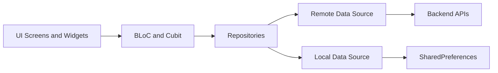
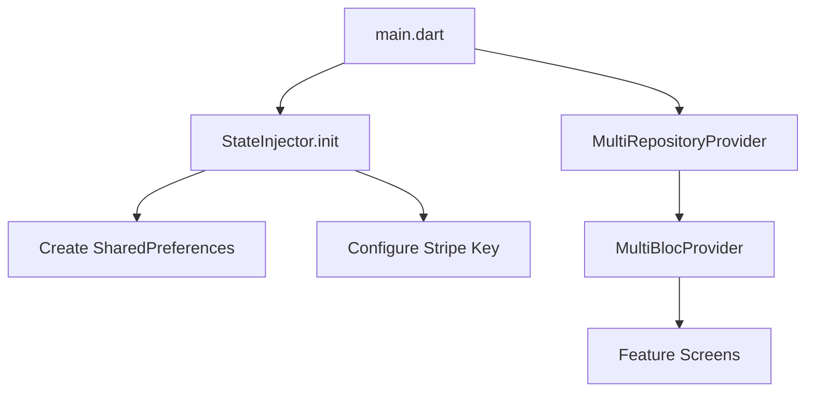
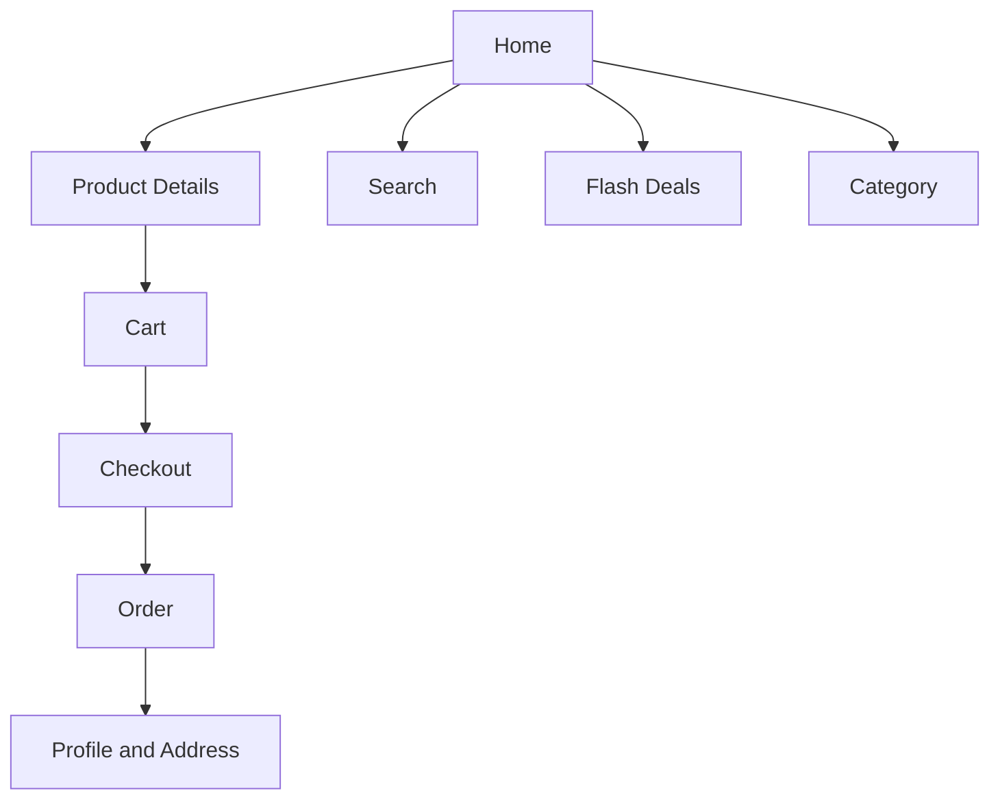
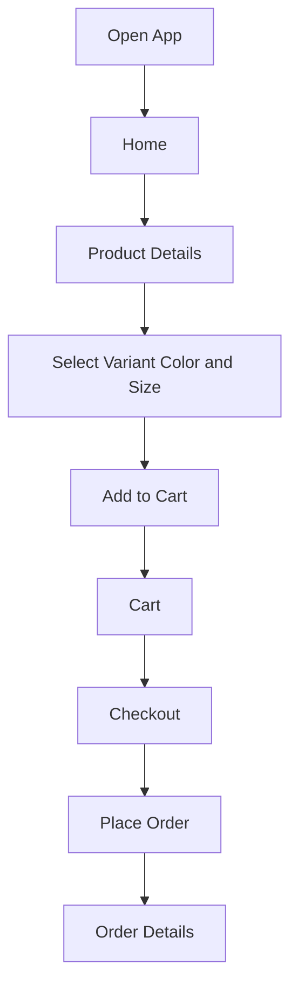
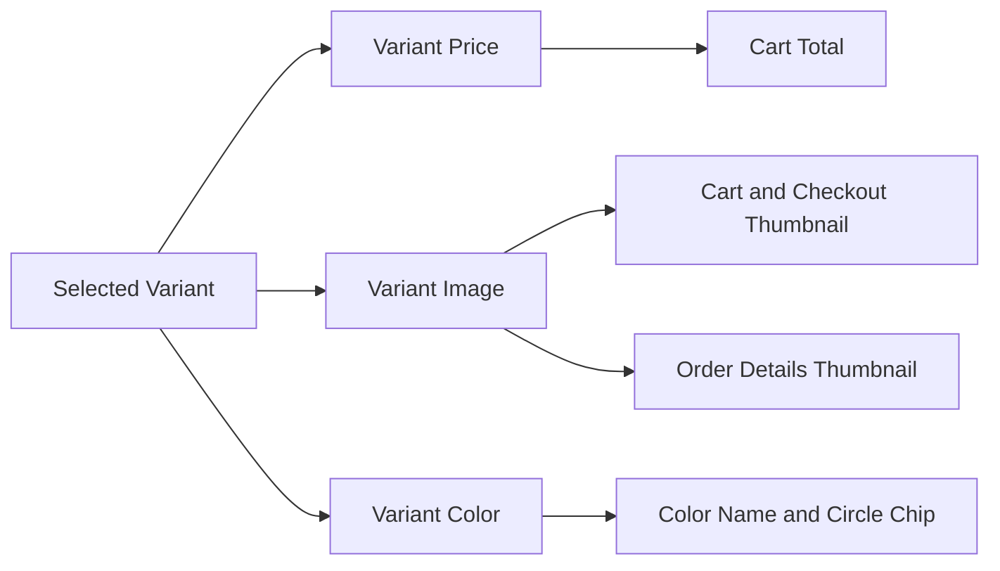
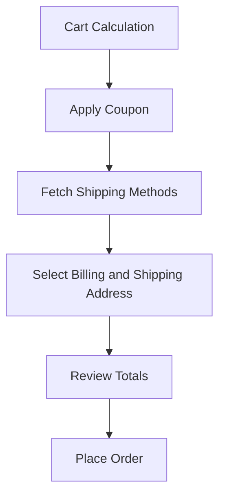
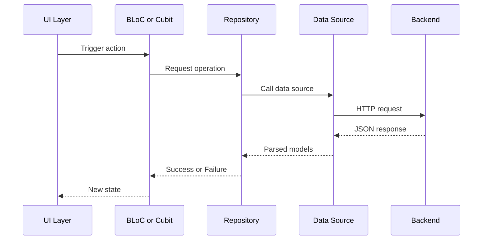

# OUI User App


Flutter-based user-facing eCommerce app for OUI with feature-first architecture, BLoC/Cubit state management, repository pattern, payment integrations, and variant-aware catalog, cart, checkout, and order flows.

## Table of Contents

- Project Overview
- Tech Stack
- Architecture
- Folder Structure
- Core User Flows
- API and Data Flow
- Error Handling and Observability
- Firebase Crashlytics Setup
- Build and Run
- Configuration Checklist
- Contributor Guide

## Project Overview

This repository contains the mobile user app for browsing products, selecting variants, managing cart and wishlist, placing orders, tracking order status, and managing account data.

Current codebase highlights:

- Feature modules under [lib/modules](lib/modules)
- Central dependency wiring in [lib/state_injector.dart](lib/state_injector.dart)
- Route registration in [lib/core/router_name.dart](lib/core/router_name.dart)
- Shared utilities in [lib/utils](lib/utils)
- App bootstrap in [lib/main.dart](lib/main.dart)

## Tech Stack

- Flutter and Dart
- flutter_bloc for state management
- dartz and repository pattern for domain/data separation
- shared_preferences for local persistence
- flutter_stripe and additional payment providers
- firebase_core and firebase_crashlytics for crash reporting

## Architecture

The app follows a feature-first modular architecture with clear layers per feature.

### Architecture Diagram



### Dependency Injection Flow



### Module Interaction Map



## Folder Structure

```text
lib/
  core/                 # Routing, remote urls, base services
  modules/              # Feature modules
	animated_splash_screen/
	authentication/
	cart/
	category/
	flash/
	home/
	order/
	payment/
	product_details/
	profile/
	search/
	setting/
	try_on/
  utils/                # Constants, helpers, language, theme, extensions
  widgets/              # Shared widgets
  state_injector.dart   # Dependency and bloc wiring
  state_inject_packages.dart
  main.dart             # App entry point
assets/
  icons/
  images/
  image/
  stripe/
```

## Core User Flows

### 1) Browse to Buy Flow



### 2) Variant Resolution Flow



### 3) Checkout Flow



## API and Data Flow



## Error Handling and Observability

- UI state errors are surfaced through feature state classes and snackbars.
- Repository-level failures are mapped to feature states.
- Global uncaught errors are captured at app bootstrap via zone and Flutter handlers.
- Crash reporting support is integrated through Firebase Crashlytics in [lib/main.dart](lib/main.dart).

## Firebase Crashlytics Setup

Yes, it is possible and now integrated in startup flow.

What was added:

- Dependencies in [pubspec.yaml](pubspec.yaml): `firebase_core` and `firebase_crashlytics`
- Crashlytics bootstrap and global handlers in [lib/main.dart](lib/main.dart)

Important: you must still connect this app to your Firebase project.

### Steps

1. Install FlutterFire CLI if needed.
2. Run from project root:

```bash
dart pub global activate flutterfire_cli
flutterfire configure
```

3. This generates a Firebase options file in lib and updates native configs.
4. For Android, ensure google-services setup is applied.
5. For iOS, ensure GoogleService-Info.plist is configured.

### Optional Validation

Trigger a non-fatal test after login or from a debug action:

```dart
FirebaseCrashlytics.instance.log('Crashlytics test log');
FirebaseCrashlytics.instance.recordError('test-error', StackTrace.current);
```

## Build and Run

```bash
flutter clean
flutter pub get
flutter run
```

## Configuration Checklist

- API base URL and keys in core config files
- Payment publishable keys and payment settings
- Firebase project linkage for Crashlytics
- Environment-specific backend endpoints

## Contributor Guide

- Keep feature code inside its module under [lib/modules](lib/modules)
- Add repositories and blocs in [lib/state_injector.dart](lib/state_injector.dart)
- Prefer shared helpers in [lib/utils/utils.dart](lib/utils/utils.dart)
- Keep UI reusable via [lib/widgets](lib/widgets)

## Notes

- The app is currently set to portrait orientation only.
- Crashlytics initialization is fail-safe and will not block app startup if Firebase is not fully configured yet.