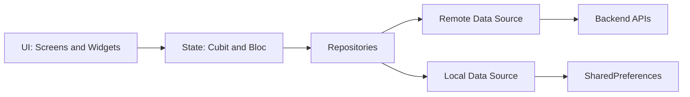
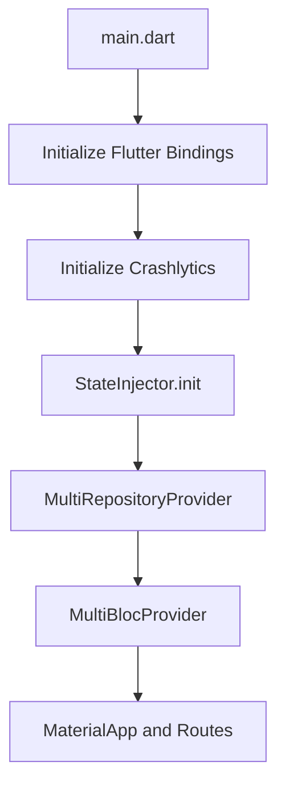
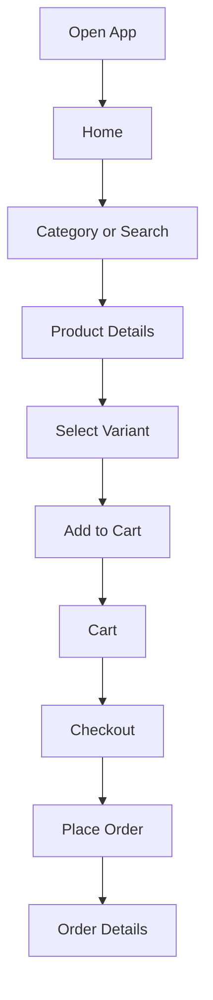
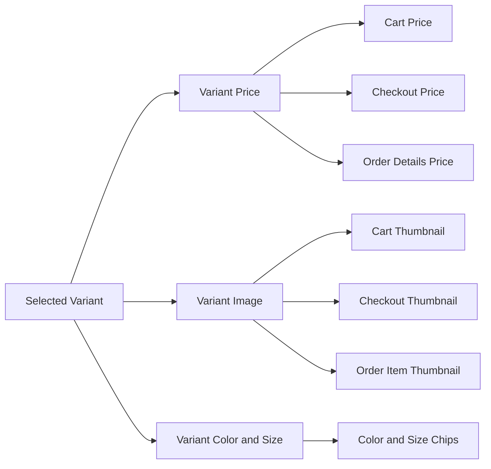
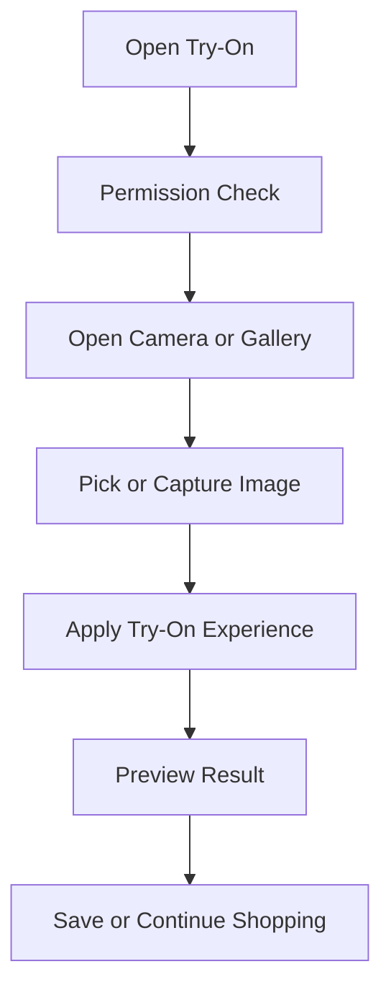
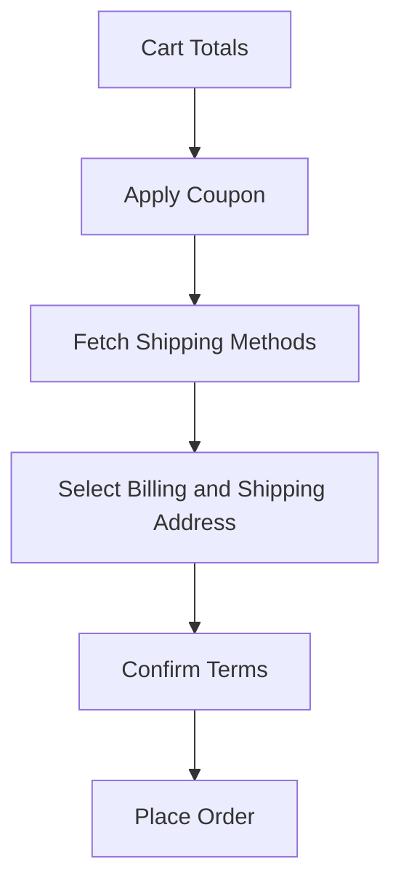
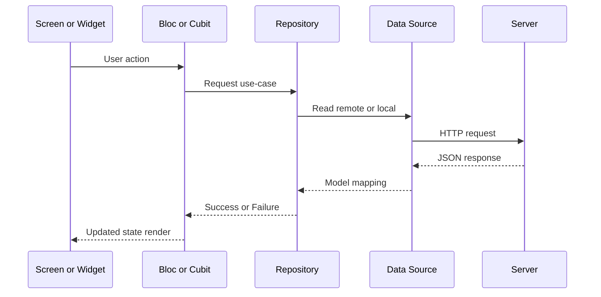

# OUI User App

<p align="left">
	
</p>

OUI User App is a Flutter-based fashion and lifestyle eCommerce mobile application focused on premium shopping, variant-rich product discovery, and smooth checkout. The app includes modern commerce features like virtual try-on, wishlist, coupons, shipping calculation, order tracking, and integrated payment options.

## What This App Provides

- Full eCommerce user journey from browsing to order tracking
- Product variants with correct color, size, price, and image mapping
- Virtual Try-On experience for selected products
- Cart and checkout with coupon and shipping flows
- Order management and order details
- User account management with addresses and profile editing
- Search, category browsing, flash deals, and seller exploration
- Notifications and inbox modules
- Crash reporting support via Firebase Crashlytics (configured in app bootstrap)

## Key Business Features

### Shopping and Product Discovery
- Home feed with collections, offers, and featured products
- Category, sub-category, and seller-based browsing
- Search with product discovery support
- Product details with gallery, variants, and reviews

### Variant-Driven Commerce
- Variant-specific pricing
- Variant-specific product image selection
- Color/size persistence across product, cart, checkout, and orders
- Color name with visual swatch rendering

### Virtual Try-On
- Try-on module with camera/gallery based user flow
- Device permissions and media integrations
- Try-on result and gallery handling for user interaction

### Checkout and Orders
- Cart quantity and line-item calculations
- Coupon application and total recalculation
- Shipping method selection and delivery cost handling
- Place order flow with address validation
- Order list and detailed order view

### Profile and Utilities
- Address management
- Wishlist management
- Notifications and inbox sections
- App settings and informational pages

## Tech Stack

- Flutter and Dart
- `flutter_bloc` for BLoC/Cubit state management
- Repository pattern with remote/local data sources
- `http`, `dartz`, `equatable` for API and model layer
- `shared_preferences` for local state persistence
- Payment integrations including Stripe (`flutter_stripe`)
- Firebase Crashlytics (`firebase_core`, `firebase_crashlytics`) for crash monitoring

## Project Architecture

The app follows a feature-first modular architecture.



### Startup and Dependency Wiring



## End-to-End User Flows

### Browse to Order Flow



### Variant Consistency Flow



### Virtual Try-On Flow



### Checkout Flow



## File and Module Architecture

### Top-Level `lib` Layout

```text
lib/
	core/                    # Routing, constants, remote URLs, shared core logic
	dummy_data/              # Static mock or supportive data
	generated/               # Generated files
	modules/                 # Feature modules
	utils/                   # Helpers, theme, language strings, constants
	widgets/                 # Reusable UI widgets
	main.dart                # App entry point
	state_injector.dart      # Dependency and bloc provider wiring
	state_inject_packages.dart
```

### Feature Modules (`lib/modules`)

```text
lib/modules/
	animated_splash_screen/
	authentication/
	cart/
	category/
	flash/
	home/
	main_page/
	message/
	notification/
	onboarding/
	order/
	place_order/
	product_details/
	profile/
	search/
	seller/
	setting/
	try_on/
```

### Assets Layout

```text
assets/
	icon/
	icons/
	image/
	images/
	stripe/
```

## API and State Data Flow



## Crashlytics and Error Observability

Crash reporting is integrated in startup with Flutter and zone error handlers.

- Bootstrap and global handlers: [lib/main.dart](lib/main.dart)
- Dependencies: [pubspec.yaml](pubspec.yaml)

To complete Firebase linkage (required for dashboard visibility):

```bash
dart pub global activate flutterfire_cli
flutterfire configure
```

Then apply native setup for Android/iOS generated by FlutterFire.

## Setup and Run

```bash
flutter clean
flutter pub get
flutter run
```

## Configuration Checklist

- API base URLs and keys
- Payment keys and provider settings
- Firebase project configuration for Crashlytics
- Android and iOS environment setup

## Developer Guidelines

- Keep new features inside [lib/modules](lib/modules)
- Register repositories and blocs in [lib/state_injector.dart](lib/state_injector.dart)
- Keep shared utilities in [lib/utils](lib/utils)
- Keep reusable UI components in [lib/widgets](lib/widgets)
- Follow variant consistency across product, cart, checkout, and order layers

## Additional Documentation

- Home dynamic API reference: [docs/HOME_DYNAMIC_APIS.md](docs/HOME_DYNAMIC_APIS.md)
- Product details API reference: [docs/PRODUCT_DETAILS_APIS.md](docs/PRODUCT_DETAILS_APIS.md)